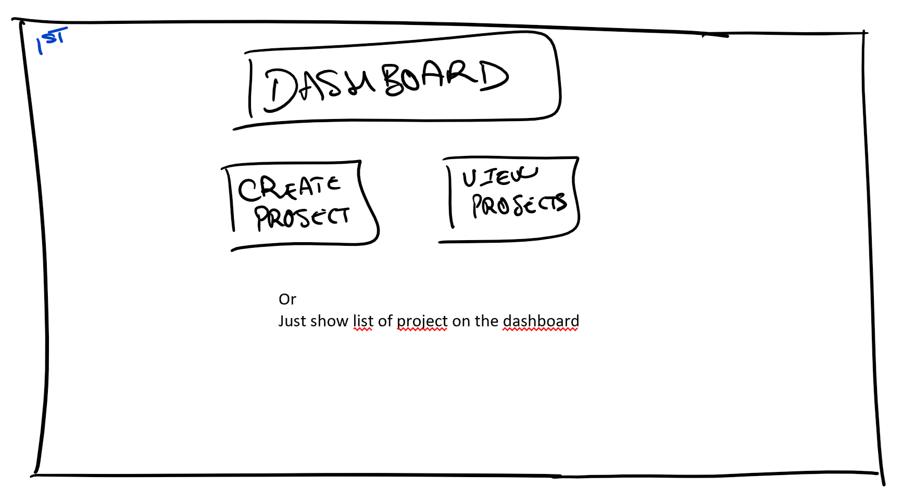
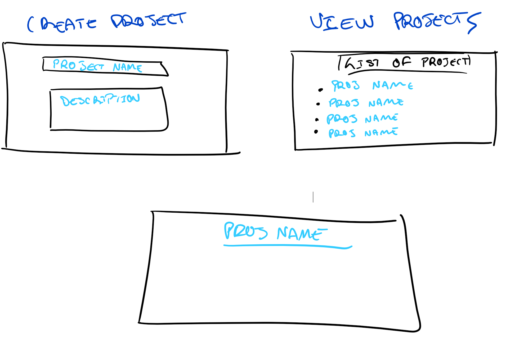

## [release repo](https://github.com/dokabdou/projet_conduite_proj_release)

### Besoins

* US1 en tant qu'utilisateur je souhaite pouvoir créer un projet avec un nom et une description sur une page dédié ou la page d'accueil

* US2 en tant qu'utilisateur je souhaite pouvoir visulaliser mes projet sous forme de liste sur une page dédié ou la page d'accueil




* US3 en tant qu'utilisateur je souhaite pouvoir être redirigé vers une page qui affiche un de mes projet lorsque je clique sur un projet dans ma liste de projet.




* US4 en tant qu'utilisateur je souhaite pouvoir ajouter une tache (texte) dans une liste de taches de mon projet sur la page de mon projet

* US5 en tant qu'utilisateur je souhaite pouvoir modifier une tache existante dans une liste de taches de mon projet sur la page de mon projet

* US6 en tant qu'utilisateur je souhaite pouvoir supprimer une tache existante dans une liste de taches de mon projet sur la page de mon projet

### Architecture & Choix des technologies
3 tiers ?
* UI: html/css
* Model: Java ou python
* BDD : postgresql

### Sprints

* [21/10 - 01/11](Sprint0.md): [Tâches](Task0.md) 

### Dev

Running the spring server:
```
./mvnw spring-boot:run
```
Running the angular front:
```
cd src/front
ng serve
```
